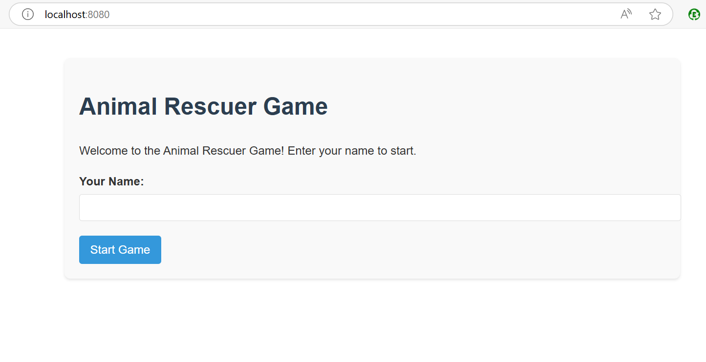

# Running this application locally on your machine as an Interactive application (NOT FLASK WEB BASED)

Make sure the requirements.txt has all dependencies needed and the Dockerfile uses the rescue_interactive.py file.

docker build -t karin86/pythonapp:latest .

docker run -it -p 8080:5000 -p 8000:8000 karin86/pythonapp:latest

## Flask web based application

The flask app file is configured to run as a Flask web app in the browser (See Dockerfile)

    docker build -t karin86/pythonapp:latest .
    docker run -p 8080:5000 -p 8000:8000 karin86/pythonapp:latest
    

Access via localhost:8080 (See Dockerfile)

## Adding new changes/extending the application

If adding any changes to the application, dockerfile or yaml files execute the following commands afterwards:

- Rebuild and push the image to docker hub registry:
    docker build -t karin86/pythonapp:latest .
    docker push karin86/pythonapp:latest
- Then force Kubernetes to pull this image from the registry:
    kubectl rollout restart deployment rescue-app -n testingopentelemetry
- Confirm that the pod has been restarted:
    kubectl get pods -n testingopentelemetry
- Check the memory crash:
    kubectl describe pod pod-name -n testingopentelemetry

You should see something similar to this under the Container section:

    State:          Waiting
    Reason:       CrashLoopBackOff
    Last State:     Terminated
      Reason:       OOMKilled
      Exit Code:    137
      Started:      Tue, 01 Apr 2025 11:07:30 +0200
      Finished:     Tue, 01 Apr 2025 11:07:42 +0200
    Ready:          False
    Restart Count:  4
